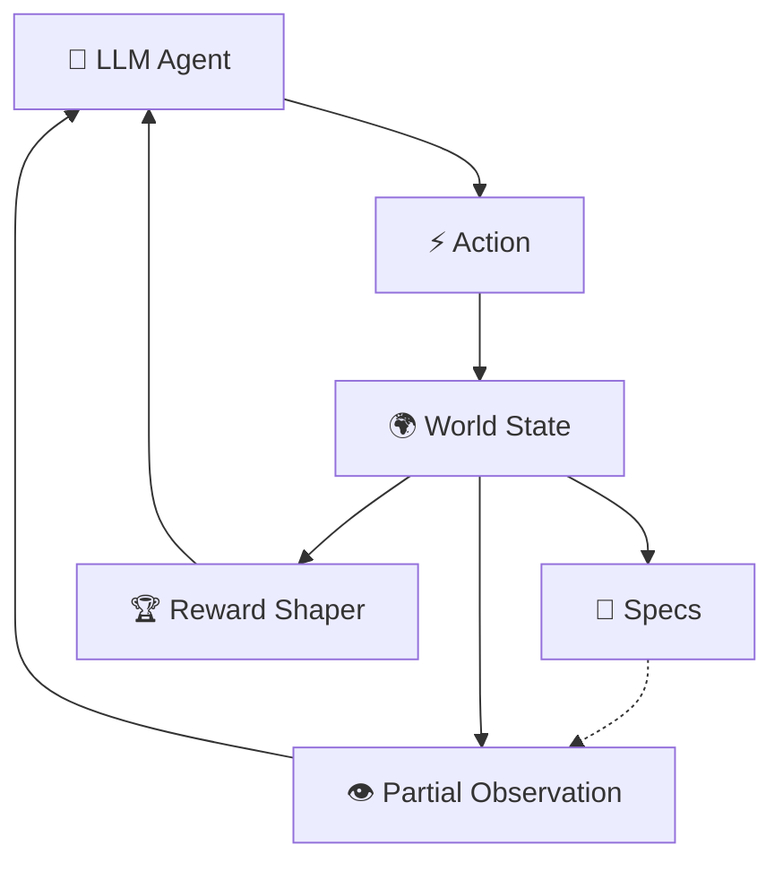

# LUMOS Assistive AI — OpenEnv Environment

## 🔄 Differences from Previous Submission

If you are a track evaluator looking at resubmissions, here is exactly what changed to move LUMOS from a toy scripted game to a Top-Tier deployable environment:
1. **Procedural Scene Generation:** Eradicated the 16-scenario limit. Scenarios now spawn with combinatorial infinity from template slots and object pools.
2. **Physical Battery Limits:** Inserted stochastic battery degradation (`w.battery_level < 5.0` fast-fail state) that explicitly throttles the action latency via `LATENCY_PENALTY`.
3. **Organic POMDP Interrupts:** The environment throws simulated hardware events (e.g., Bluetooth ping) that scale dynamically with the state's `noise_level`.
4. **Tightened Success Gates:** Handling system-critical interrupts via LLM reasoning is now an enforced prerequisite for receiving a `True` completion grade on a task.
5. **No More Random Score Inflations:** Removed all flat reward jitter (`±0.012`) so randomness only affects physical bounds.

---

> *"Train AI agents to see for the blind, hear for the deaf, and speak for the mute."*

LUMOS is a real-world OpenEnv environment built around an assistive AI glasses project designed for people with visual, hearing, and speech impairments. It provides three tasks of increasing difficulty, each modelling a real hardware feature of a wearable device.

---

## 💡 Clarity of Idea: Why Simulate Wearable AI?

Most LLM benchmarks focus on turn-by-turn chat. But real-world assistive AI running on IoT hardware (like smart glasses) faces **physical and sensory boundaries**. 

LUMOS is built so that every point of improvement maps directly to assistive technology feasibility.

| Population | Real-world application | LUMOS Task |
|---|---|---|
| Visually impaired (**2.2B**) | Scene description & hazard alerts | `blind_mode` |
| Hearing impaired (**1.5B**) | Live captioning with noise filtering | `deaf_mode` |
| Speech-impaired (**Millions**) | Real-time ASL translation | `mute_mode` |

---

## 🛠️ Justification: Real-World Constraints

To accurately benchmark agents for real-world deployment, LUMOS injects physical constraints that go beyond basic RL textbook problems. **This is not arbitrary randomness; every constraint is grounded in physical IoT limitations.**

| System Constraint | Justification in LUMOS |
|---|---|
| **Battery drain & Throttling** | The glasses run on a finite battery. Taking too many steps drains the battery. Below 20%, thermal throttling engages, increasing the `LATENCY_PENALTY` by 2.0x. Agents *must* be efficient. |
| **Sensory Degradation** | `scene_clarity` degrades slightly over time as the user moves. Visual targets fade. The agent cannot stall; it must acquire a target and act. |
| **Low-priority Notifications** | Wearable devices throw low-priority notifications (e.g., "Bluetooth weak", simulated as system interrupts). If the agent drops a safety-critical task to handle a false alarm, it is penalized for distraction. |
| **Repetitive Lock-in** | If an LLM hallucinates an action sequence and repeats the identical blind action three times, it is penalized for wasting compute cycles. |
| **Sensory Overrides** | Standard "ambiguous" tags are easy to game. Under heavy visual noise, LUMOS occasionally forces a false high-confidence reading (e.g., ASL E instead of S). The agent must use multi-turn context to override the sensor physically (`request_repeat`). |

---

### 🌟 Example Scenario (Real-World Simulation)

A blind user is walking in a dim parking lot:
- Scene clarity is naturally degrading over time.
- A moving vehicle is partially visible.
- A low-priority Bluetooth interrupt appears mid-step.
- Battery drops below 20% → latency penalty increases.

The agent must:
1. **Ignore** the low-priority system notification.
2. **Improve** clarity via `scan` before the visual fades completely.
3. **Focus** on the moving object.
4. **Detect** the hazard and `alert_danger` to the user in time.

This demonstrates true real-world decision-making under uncertainty, device constraints, and distractions.

---

## What Makes This a Real RL Environment

### POMDP Architecture



Unlike static Q&A environments, LUMOS is designed to genuinely stress-test agent POMDP capabilities:

- **Resource Limits** — every step drains battery and adds latency. Stalling means failure.
- **Physical Sensor Degradation** — the environment's observation channels actively corrupt and fade without agent intervention.
- **Dynamic Asynchronous Events** — critical notifications can interrupt the agent dynamically, overriding the task context.

---

## Tasks

| Task | Difficulty | Description |
|------|-----------|-------------|
| `blind_mode` | Easy | Interpret camera feed under fading clarity → systematically discover hazards → alert the user safely. |
| `deaf_mode` | Medium | Relay word chunks over a microphone transcript → filter ambient physical noise tags `[STATIC]` → reconstruct correct transcript. |
| `mute_mode` | Hard | Read extremely noisy ASL predictions → utilize physical overrides (`request_repeat`) → output exact word match avoiding confusion letter pairs. |

---

## Observation Space

Matches `server/models.py`:

| Field | Type | Description |
|-------|------|-------------|
| `task_id` / `episode_id` | str | Identification labels |
| `step_number` / `steps_remaining` | int | Temporal latency limits |
| `camera_feed` | str | Visual shapes and physical context |
| `scene_clarity` | float | Global visual clarity `[0,1]` |
| `visible_objects` | list[str] | Objects focused successfully |
| `audio_stream` | str | Raw speech transcript via microphone |
| `noise_level` | float | Affects auditory and visual noise distortion `[0,1]` |
| `asl_observation` / `asl_confidence` | str | Live ASL hand-spelling data |
| `confirmed_so_far` | str | Committed letters buffer |
| `interrupt` / `interrupt_urgency` | str | Dynamic hardware notifications |
| `last_action_feedback` | str | Internal system logs from step |

---

## Action Space

Matches `server/models.py`:

| Field | Type | Description |
|-------|------|-------------|
| `action_type` | str | e.g., `scan`, `focus_object`, `relay_text`, `request_repeat` |
| `target` | str \| null | Physical object or ASL letter |
| `content` | str \| null | Text generated for the user OLED/TTS |
| `confidence` | float | `[0,1]` Self-reported confidence score |
| `priority` | str \| null | e.g. `handle_interrupt` |

---

## Reward Design

Rewards are **shaped** (not sparse) — partial credit at every step:

| Component | Task | Description |
|---|---|---|
| `confidence_bonus` | all | Small reward proportional to confidence (max 0.03) |
| `correct_decision` | all | Reward for correct action type based on state |
| `latency_penalty` | all | Negative reward proportional to battery drain per step |
| `hazardous_alert` | `blind_mode` | Reward for correctly identifying *all* hazards |
| `key_words_relayed` | `deaf_mode` | Partial credit for preserving rare speech content |
| `exact_match` | `mute_mode` | Only given for speaking the final target word |

All rewards clipped to `[-1.0, 1.0]`.

**Key strictness notes:**
- `blind_mode`: wrong `action_type` gives penalty. Unhandled critical interrupts revoke success.
- `deaf_mode`: wrong `action_type` gives penalty; success requires **all** key words present. Unhandled critical interrupts revoke success.
- `mute_mode`: wrong `action_type` gives penalty; only *exact* full-word match triggers success. Unhandled critical interrupts revoke success.

---

## API Endpoints

```
POST /reset?task_id=blind_mode    # Start new episode
POST /step                            # Take one step
GET  /state                       # Current internal state
GET  /tasks                       # Task list + action schemas
POST /grader                      # Grader score for current episode
GET  /baseline                    # Run LLM agent, return scores
```

---

## 🚀 Building a Custom Agent (No Dependencies)

LUMOS is built as a pure JSON API. You do not need external RL libraries to build an agent—a standard `requests` block is all you need to interact with the POMDP loop dynamically:

```python
import requests
import random

BASE_URL = "http://localhost:7860"

def run_random_agent(task_id="blind_mode", max_steps=10):
    print(f"Starting {task_id} episode...")
    obs = requests.post(f"{BASE_URL}/reset?task_id={task_id}").json()
    
    for step in range(max_steps):
        # 1. Parse Observation (POMDP state)
        clarity = obs.get("scene_clarity", 0)
        print(f"Step {step+1} | Clarity: {clarity:.2f} | Battery: {obs.get('battery_level', 100)}%")
        
        # 2. Agent Logic (Random fallback in this example)
        action_payload = {
            "action_type": random.choice(["scan", "focus_object", "alert_danger"]),
            "target": None,
            "content": "Emergency!",
            "confidence": 0.8,
            "priority": "current_task"
        }
        
        # 3. Environment Step Transition
        res = requests.post(f"{BASE_URL}/step", json=action_payload).json()
        obs = res["observation"]
        print(f"  -> Reward: {res['reward']:.3f} | {obs['last_action_feedback']}")
        
        if res["done"]:
            grader = requests.post(f"{BASE_URL}/grader").json()
            print(f"Episode Done. Final Score: {grader['average_score']:.3f}")
            break

if __name__ == "__main__":
    run_random_agent()
```

---

## Setup & Usage

### Local

```bash
pip install -r requirements.txt
uvicorn server.app:app --host 0.0.0.0 --port 7860
```

### Docker

```bash
docker build -t lumos-openenv .
docker run -e API_KEY=your_groq_key_here -p 7860:7860 lumos-openenv
```

### Run Inference

```bash
export API_BASE_URL="https://api.groq.com/openai/v1"  # Or your HuggingFace endpoint
export MODEL_NAME="meta-llama/llama-4-scout-17b-16e-instruct"
export API_KEY="your_api_key_here"
export BASE_ENV_URL="http://localhost:7860"
python inference.py
```

### Quick API Test

```python
import requests

BASE = "http://localhost:7860"

# Reset to deaf relay mode
obs = requests.post(f"{BASE}/reset?task_id=deaf_mode").json()
print("Initialized Episode:", obs["episode_id"])

# Take a step — relay a text block
action = {
    "action_type": "relay_text",
    "target": None,
    "content": "Defibrillator malfunction in cardiac catheterisation suite — technician en route",
    "confidence": 0.9,
    "priority": "current_task"
}
result = requests.post(f"{BASE}/step", json=action).json()
print("Reward:", result["reward"])
```

---

## Baseline Scores

Scores vary due to stochastic environment.

Typical ranges with `meta-llama/llama-4-scout-17b-16e-instruct`:
- `blind_mode`: 0.75–0.95
- `deaf_mode`: 0.70–0.90
- `mute_mode`: 0.70–0.85

---

## Real Hardware

This environment simulates the **LUMOS AI Glasses** — a physical wearable built with:

| Component | Purpose |
|---|---|
| Raspberry Pi Zero 2W + Arducam IMX219 8MP | Camera capture |
| Waveshare transparent OLED display | Text overlay for deaf users |
| Gemini Vision API | Scene understanding |
| OpenAI Whisper | Speech recognition |
| Piper TTS (offline) | Text-to-speech for blind users |
| Procedural Phonetic Generation | ASL translation logic (simulated stochastic sequences) |
| MediaPipe | Hand/finger tracking simulation |

---

## Project Structure

```
lumos-assistive-ai/
├── server/
│   ├── __init__.py           # Server package init
│   ├── app.py                # FastAPI app — uvicorn & OpenEnv entry point
│   ├── lumos_environment.py  # Core POMDP environment logic (all 3 tasks)
│   └── scene_generator.py    # Procedural scene / audio / ASL generators
├── models.py               # Shared Pydantic schemas (Action, Observation)
├── inference.py            # LLM agent baseline script
├── client.py               # Minimal HTTP client helper
├── baseline_scores.json    # Cached baseline benchmark results
├── openenv.yaml            # OpenEnv spec metadata
├── pyproject.toml          # Project metadata & entry points
├── Dockerfile              # Container definition
├── requirements.txt        # Python dependencies
└── README.md               # This file
```

> **Entry point note:** `server/app.py` is the sole FastAPI entry point. It is registered in `pyproject.toml` as `server.app:main` for `openenv validate`, and used directly by Dockerfile/uvicorn as `uvicorn server.app:app`. `models.py` lives at root and is imported via a try/except fallback so it works both locally and inside the container.
